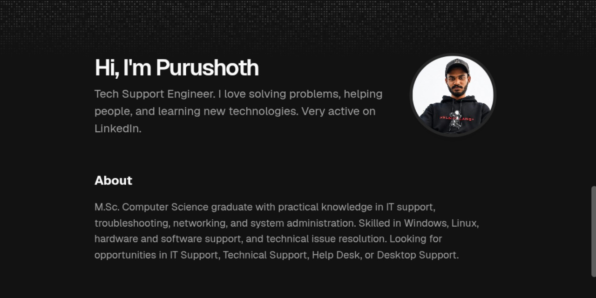

<div align="center">
  
</div>

# Purushoth - Portfolio [


](https://vercel.com/new/clone?repository-url=https%3A%2F%2Fgithub.com%2FBruceMorpho%2Fpurushoth_portfolio)

Hi, I'm **Purushoth**, a Tech Support Engineer from Chennai, Tamil Nadu. This is my personal portfolio, where I showcase my skills, education, projects, and certifications.

# About Me

M.Sc. Computer Science graduate with practical knowledge in IT support, troubleshooting, networking, and system administration. Skilled in Windows, Linux, hardware and software support, and technical issue resolution. Looking for opportunities in IT Support, Technical Support, Help Desk, or Desktop Support.

# What's Inside

- **Skills:** Windows, Linux, Networking, Ticketing Tools, Wireshark, Python, Active Directory
- **Education:** M.Sc Computer Science (2023-2025) and B.Sc Computer Science (2020-2023), Bharathidasan University
- **Projects:**
  - Resume Analyzer, an AI recruitment tool built with Python, Pandas, Flask and Machine Learning
  - A Review of Liver Patient Analysis Methods Using Machine Learning (SVM, Decision Tree, Random Forest)
  - [BioVerix Technologies Website](https://bioverixtechnology.netlify.app/), a responsive website for an aquaculture and biotechnology company
- **Certifications:** IBM IT Fundamentals, Cybersecurity Analyst Job Simulation (Forage & Tata), Introduction to Information Security & Fundamentals, Be10x AI Tools Workshop

# Tech Stack

Next.js, React, TypeScript, Tailwind CSS, shadcn/ui, Magic UI, Framer Motion, deployed on Vercel.

# Run Locally

```bash
git clone https://github.com/BruceMorpho/purushoth_portfolio
cd purushoth_portfolio
pnpm install
pnpm dev
```

Then open http://localhost:3000. All the content is managed from [src/data/resume.tsx](./src/data/resume.tsx).

# Connect With Me

- LinkedIn: [purushoth-tech](https://linkedin.com/in/purushoth-tech)
- GitHub: [BruceMorpho](https://github.com/BruceMorpho)
- Email: purushothaman2709@gmail.com

# License

Licensed under the [MIT license](./LICENSE).
